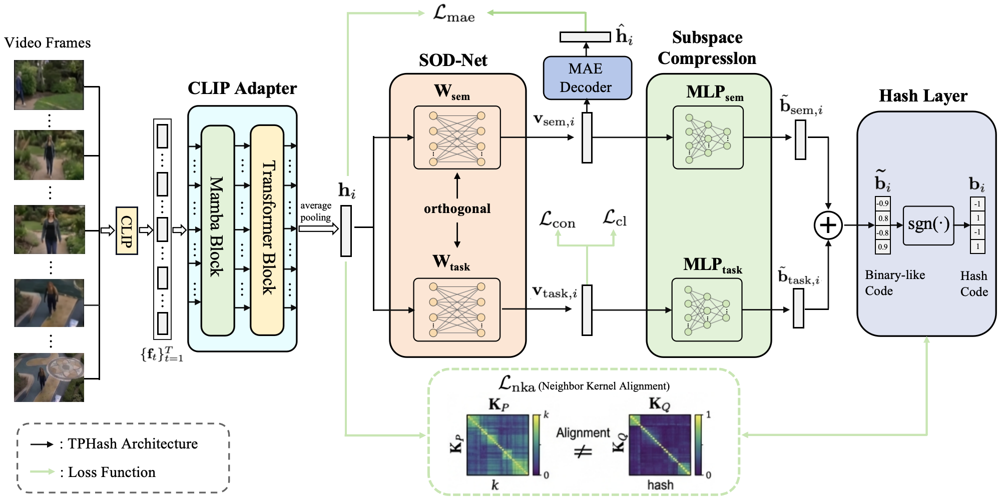

# TPHash: Topology-Preserving Self-Supervised Video Hashing via Quantization Topology Distillation



## Catalogue <br> 
* [1. Getting Started](#Getting-Started)
* [2. Training](#Training)
* [3. Testing](#Testing)
* [4. Trained Models](#Trained-Models)
* [5. Results](#Results)


## Getting Started

### 1. Clone Repository
```bash
git clone https://github.com/anon271/TPHash
cd TPHash
```

### 2. Environment Setup
```bash
conda create -n TPHash python=3.10.13
conda activate TPHash
conda install pytorch==2.1.1 pytorch-cuda=11.8 -c pytorch -c nvidia
pip install -r requirements.txt
```

### 3. Download Datasets
Clip feature of FCVID and ActivityNet are provided by the authors of [AVHash]. You can download these datasets from Baidu disk:

| Dataset | Link |
|---------|------|
| FCVID | [Baidu disk](https://pan.baidu.com/s/1xlViGrhOQ8Jrwgn0UEtukg?pwd=snw3) |
| ActivityNet | [Baidu disk](https://pan.baidu.com/s/1d9B8p-1oVNRy88Xgo5somw?pwd=6ji8) |
| UCF101 | [Baidu disk](https://pan.baidu.com/s/13M0t-ttdE_GRh4jApfrrsw?pwd=qhb9) |

### 4. Configure Dataset Paths
Modify the dataset paths in the corresponding JSON files:
- Json/Anet.json
- Json/fcvid.json
- Json/ucf.json

## Training

### Training TPHash:

1. Modify parameters in `run.py`:
   - `data_set_config`: Path to dataset JSON file
   - `max_iter`: Number of epochs for pre-training and training
   - `result_log_dir`: Root directory for training logs
   - `result_weight_dir`: Root directory for model weights
   - `lr`: Learning rate
   - `batch_size`: Training batch size
   - `hidden_size`: Encoder hidden layer width
   - `decoder_size`: Decoder hidden layer width
   - `hashcode_size`: Hash code dimension
   - `weight_path`: Path to load trained model
   - `cfg`: Hyperparameters (see paper for details)

2. Run pre-training:
```bash
python run.py
```

3. For training:
   - Change `from pretrain import train_model` to `from train import train_model`
   - Update `weight_path` to pre-trained model weights directory
```bash
python run.py
```

## Testing

### Testing TPHash:

1. Modify `run.py`:
   - Change `from train import train_model` to `from test import train_model`
   - Update `weight_path` to trained model weights directory

2. Run testing:
```bash
python run.py
```

## Trained Models

Trained TPHash checkpoints are available for download from: [Baidu disk](https://pan.baidu.com/s/1qdCe6eZQR6ijhen_MbDbUg?pwd=mfok#list/path=%2F) .

## Results

For this repository, the expected performance is:

| *Dataset* | *Bits* | *mAP@5* | *mAP@20* | *mAP@40* | *mAP@60* | *mAP@80* | *mAP@100* |
| ---- | ---- | ---- | ---- | ---- | ---- | ---- | ---- |
| FCVID | 16 | 0.492 | 0.361 | 0.323 | 0.303 | 0.287 | 0.273 |
| FCVID | 32 | 0.558 | 0.424 | 0.384 | 0.362 | 0.345 | 0.328 |
| FCVID | 64 | 0.578 | 0.448 | 0.409 | 0.387 | 0.368 | 0.351 |
| Act-Net | 16 | 0.311 | 0.265 | 0.220 | 0.185 | 0.166 | 0.143 |
| Act-Net | 32 | 0.378 | 0.342 | 0.246 | 0.202 | 0.178 | 0.153 |
| Act-Net | 64 | 0.386 | 0.353 | 0.251 | 0.206 | 0.181 | 0.165 |
| UCF101 | 16 | 0.576 | 0.503 | 0.486 | 0.379 | 0.276 | 0.173 |
| YFCC | 32 | 0.687 | 0.608 | 0.590 | 0.483 | 0.380 | 0.277 |
| YFCC | 64 | 0.792 | 0.711 | 0.693 | 0.586 | 0.481 | 0.379 |


[AVHash]:https://github.com/iFamilyi/AVHash

